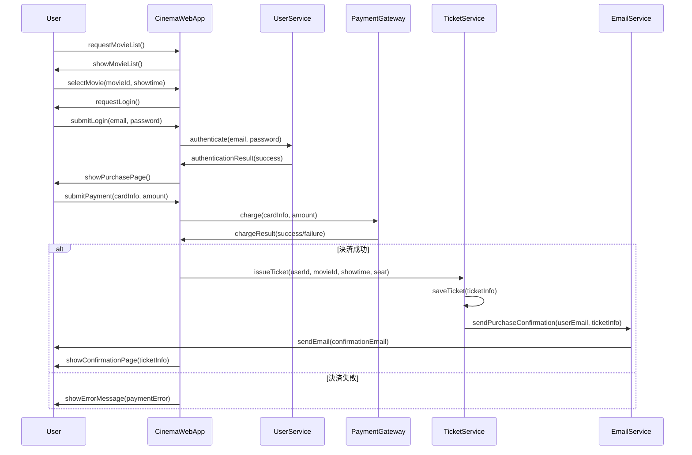

"# wf-dev" 
映画チケット購入システムのシーケンス図を作成いたします。

## 1. 参加オブジェクト（ライフライン）の洗い出し

- **User** - ユーザー
- **CinemaWebApp** - 映画館Webアプリケーション
- **UserService** - ユーザー認証サービス
- **PaymentGateway** - 決済ゲートウェイ
- **TicketService** - チケット管理サービス
- **EmailService** - メール送信サービス

## 2. シーケンス図に含めるメッセージ一覧の作成

- User → CinemaWebApp: requestMovieList()
- CinemaWebApp → User: showMovieList()
- User → CinemaWebApp: selectMovie(movieId, showtime)
- CinemaWebApp → User: requestLogin()
- User → CinemaWebApp: submitLogin(email, password)
- CinemaWebApp → UserService: authenticate(email, password)
- UserService → CinemaWebApp: authenticationResult(success)
- CinemaWebApp → User: showPurchasePage()
- User → CinemaWebApp: submitPayment(cardInfo, amount)
- CinemaWebApp → PaymentGateway: charge(cardInfo, amount)
- PaymentGateway → CinemaWebApp: chargeResult(success/failure)
- CinemaWebApp → TicketService: issueTicket(userId, movieId, showtime, seat)
- TicketService → TicketService: saveTicket(ticketInfo)
- TicketService → EmailService: sendPurchaseConfirmation(userEmail, ticketInfo)
- EmailService → User: sendEmail(confirmationEmail)
- CinemaWebApp → User: showConfirmationPage(ticketInfo)

## 3. シーケンス図の作成

